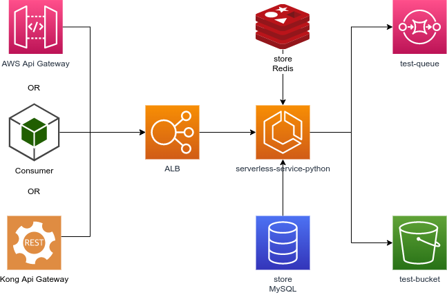

# template-serverless-service-python
Template para construção de API flexível com serviços ECS AWS.

[](https://github.com/PyCQA/pylint)
[](https://www.python.org/dev/peps/pep-0008/)
[](https://sonarcloud.io/summary/new_code?id=madeiramadeirabr_template-serverless-service-python)
[](https://sonarcloud.io/summary/new_code?id=madeiramadeirabr_template-serverless-service-python)
[](https://sonarcloud.io/summary/new_code?id=madeiramadeirabr_template-serverless-service-python)

## Arquitetura de serviços
Diagramas aplicados com o uso desta arquitetura

Mais detalhes [aqui](https://drive.google.com/file/d/112om-id0zfd8qGd0Q4kTaoIwIgwx6DGJ/view?usp=sharing).

### Arquitetura em nuvem
Exemplo da arquitetura que roda no AWS Cloud.



### Arquitetura de Docker
Exemplo da arquitetura que funciona com o docker.


## Arquitetura Geral de Rotas de Serviço
Exemplo de documentação OpenApi.


Lista de rotas:
```
GET / - Root
GET /docs - Swagger docs
GET /alive - Health Check
GET /v1/product - Product List
POST /v1/product - Product Create
DELETE /v1/product/<uuid> - Soft Product Delete
GET /v1/product/<uuid> - Product Get
PATCH /v1/product/<uuid> - Soft Product Update
PUT /v1/product/<uuid> - Complete Product Update
```

# Pré requisitos
- Python >=3.6
- docker
- docker-compose
- python-dotenv
- jsonformatter
- requests
- pytz
- redis
- pyyaml
- apispec
- marshmallow
- Flask

## Componentes
- Docker-compose
- Localstack
- OpenApi
- SQS Integration
- Flask
- MySQL
- Redis
- Swagger
- Restful
- HATEOS

## Detalhes sobre os arquivos de requirements
### requirements.txt
Coleção de módulos de aplicação comum, módulos leves.

### requirements-local.txt
Coleção de módulos de desenvolvimento específicos.

### requirements-tests.txt
Coleção de módulos de aplicação de testes específicos.

### requirements-vendor.txt
Coleção de módulos de aplicação específicos, módulos pesados que podem ser convertidos em níveis, se necessário.

## Configuração Kong
Configure o Kong API Gateway para trabalhar compatívelmente com o API Gateway.


## Instalação
### Instalando AWS CLI
Documentação:
https://docs.aws.amazon.com/pt_br/cli/latest/userguide/install-cliv2.html

Execute os seguintes comandos:
```bash
apt install python38-env
apt install awscli
apt install zip
app install pip
```
Execute o seguinte comando:
```bash
aws configure
```

### Instalando o suporte python venv
Execute o seguinte comando:
```bash
apt install python38-env
```

### Executando Localmente
Para criar o `venv` e instalar os módulos, execute:
```bash
./scripts/venv.sh
```
#### Executando o app
Execute o seguinte comando:
```bash
./scripts/flask/run-local.sh
```
### Executando via docker
Para executar a build:
```bash
./scripts/runenv.sh --build
```

Execute o seguinte comando:
```bash
./scripts/runenv.sh
```

### Recuperando o ambiente em casos de erro
Execute o seguinte comando:
```bash
./scripts/fixenv.sh
```

## Informações sobre scripts de automação
A seguir descrevemos o uso dos scripts de automação.
Estes scripts kebab case ajudam o desenvolvedor nas tarefas em geral.

### Scripts gerais
Kebab case scripts para ajudar o desenvolvedor em tarefas gerais.

| Script                      | Descrição                                                                      | Contexto           |
|-----------------------------|-----------------------------------------------------------------------------------|-------------------|
| autopep8.sh                 | Executa o code-lint para pep8                                                     | Codelint          |
| boot.sh                     | Inicia a aplicação durante a execução do container                                | Local boot        |
| boot-db.sh                  | Inicia os dados para o banco de dados                                             | Local boot        |
| boot-queues.sh              | Inicia as filas de espera da aplicação no localstack                              | Local boot        |
| boot-validate-connection.sh | Checa se o localstack esta pronto para conectar                                   | Local boot        |
| clean-env.sh                | Limpar a pasta ./vendor                                                           | Local install     |
| commit.sh                   | Executa a ferramenta de comunitarização para commitar a mensagem                  | Local development |
| fixenv.sh                   | Em alguns casos em que a rede é deletada, você pode corrigir as referências dos containers | Local install     |
| install.sh                  | Script para instalar as dependências                                              | Local install     |
| install-local.sh            | Script para instalar as dependências na pasta ./vendor                            | Local install     |
| openapi.sh                  | Script para gerar o openapi.yaml                                                  | CI/CD pipeline    |
| pre-commit-config.sh.sh     | Script para preparar o ambiente local para executar ferramentas de pre-commit     | Local development |
| preenv.sh                   | Script para executar os comandos de pré build                                     | Local boot        |
| pylint.sh                   | Script para executar a análise pylint                                             | Local development |
| runenv.sh                   | Script para iniciar o projeto localmente                                          | Local development |
| testenv.sh                  | Script para executar o ambiente com foco nos testes de componentes                | Local development |
| venv.sh                     | Script para instalar as dependências na pasta venv                                | Local install     |
| venv-exec.sh                | Script para executar scripts para instalar conteúdo dentro do venv                | Local install     |
| zip.sh                      | Gera um arquivo zip com o conteúdo da aplicação                                   | Other             |

### Docker scripts
Scripts que facilitam as tasks para contexto do docker;
### Flask scripts
Scripts que ajudam a executar o flask localmente, não dentro de um container do docker;
### Localstack scripts
Scripts que ajudam a executar comandos sobre os recursos Localstack, como S3, SQS, Lambda, etc;
### Scripts de migração
Scripts que ajudam a executar migrações;
### OpenApi scripts
Scripts que ajudam a gerar diagramas e especificações openapi;
### Scripts de testes
Scripts que ajudam a executar testes and gerar relatórios;
## Amostras
Veja as amostras do projeto nesta pasta [aqui](samples).

## Executando testes
Para executar os testes unitários do projeto, você pode executar o seguinte comando:

Primeiro você precisa instalar os requisitos de testes:
 ```bash
 ./scripts/venv-exec.sh ./scripts/tests/install-tests.sh
 ```


### Testes unitários:
Executando os testes:
 ```bash
./scripts/venv-exec.sh ./scripts/tests/unit-tests.sh
 ```
Executando um arquivo específico:
 ```bash
./scripts/venv-exec.sh ./scripts/tests/unit-tests.sh /tests/unit/test_app.py
 ```
### Testes de componentes:
Inicie os containers de docker:
 ```bash
./scripts/testenv.sh
```

Executando os testes:
 ```bash
./scripts/venv-exec.sh ./scripts/tests/component-tests.sh
```
Executando um arquivo específico:
 ```bash
./scripts/venv-exec.sh ./scripts/tests/component-tests.sh /tests/component/test_app.py
 ```
### Testes de integração:
Copie o arquivo `env/integration.env.example` para
`env/integration.env` e edite com os parametros de staging.

Executando os testes:
 ```bash
./scripts/venv-exec.sh ./scripts/tests/integration-tests.sh
```
Executando um arquivo específico:
```bash
./scripts/venv-exec.sh ./scripts/tests/integration-tests.sh /tests/integration/test_app.py
```

### Todos os testes:
Executando os testes:
```bash
 ./scripts/venv-exec.sh ./scripts/tests/tests.sh
 ```

## Geração de relatórios de cobertura
Para executar os testes de cobertura, você pode executar os seguintes comandos:

### Cobertura de teste de unidade:
Execute o seguinte comando:
```bash
./scripts/venv-exec.sh ./scripts/tests/unit-coverage.sh
```cont

### Cobertura de teste de componente:
Inicie os containers de docker:
```bash
./scripts/testenv.sh
```

Execute o seguinte comando:
```bash
./scripts/venv-exec.sh ./scripts/tests/component-coverage.sh
```

### Cobertura de teste de integração:

Copie o arquivo `env/integration.env.example` para
`env/integration.env` e edite com os parametros de staging.

Execute o seguinte comando:
```bash
./scripts/venv-exec.sh ./scripts/tests/integration-coverage.sh
```
> Observação:

O resultado pode ser encontrado na pasta `target/*`.


## Licença
Veja a licença: [LICENSE.md](LICENSE.md).

## Contribução
* Anderson de Oliveira Contreira [andersoncontreira](https://github.com/andersoncontreira)

## Configuração IDE
* Para a sintaxe da docstring, por favor use o `reStructuredText`
* Para uso de limite de linha 100 caracteres, conforme definido pelo PEP8

## Pylint
Para executar o pylint no código fonte do projeto, execute o seguinte comando:
```bash
./scripts/pylint.sh
```
Ou:

```bash
./scripts/pylint.sh ./app.py
```

## AutoPEP8
Para executar o autopep8 no código fonte do projeto, execute o seguinte comando:
```bash
./scripts/autopep8.sh
```
Ou:

```bash
./scripts/autopep8.sh ./app.py
```

## Pre-commit
Para instalar o pré-commit para executar o ambiente de desenvolvimento local:
```bash
./scripts/venv.sh
```
> os detalhes da biblioteca estão presentes no requirements-local.txt

Depois de você executar:

```bash
./scripts/pre-commit-config.sh
```
